# 🌅 AndhraVista
AndhraVista is a modern, responsive web application designed to showcase the beauty and tourism destinations of Andhra Pradesh. It features interactive destination guides, stunning photo galleries, and practical visitor information, providing a comprehensive travel planning experience with a premium user interface.

## 🎥 Demo Videos
Watch the full demo videos of AndhraVista on YouTube!

**🌙 Dark Theme Preview**  
[](https://youtu.be/Rreo6MzX89o)

**☀️ Light Theme Preview**  
[](https://youtu.be/T1QlVhgsJR8)

## ✨ Features
🗺️ **Interactive Destination Guides:** Detailed information on popular tourist spots including historical sites, temples, and natural wonders.
📸 **Stunning Photo Galleries:** High-quality masonry layouts showcasing the scenic landscapes and cultural heritage.
✨ **Modern Premium UI:** Smooth animations and transitions built with Framer Motion and Tailwind CSS.
📊 **Practical Visitor Info:** Essential travel details, tips, and location mapping for easy trip planning.
📱 **Fully Responsive:** Optimized for a seamless browsing experience across all devices.

## 📸 Project Screenshots

### 1. AndhraVista Homepage Hero Banner
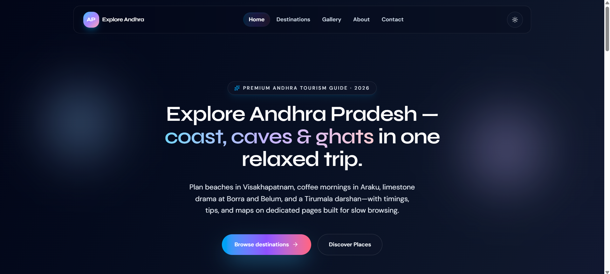

### 2. AndhraVista Welcome and Quick Facts Section
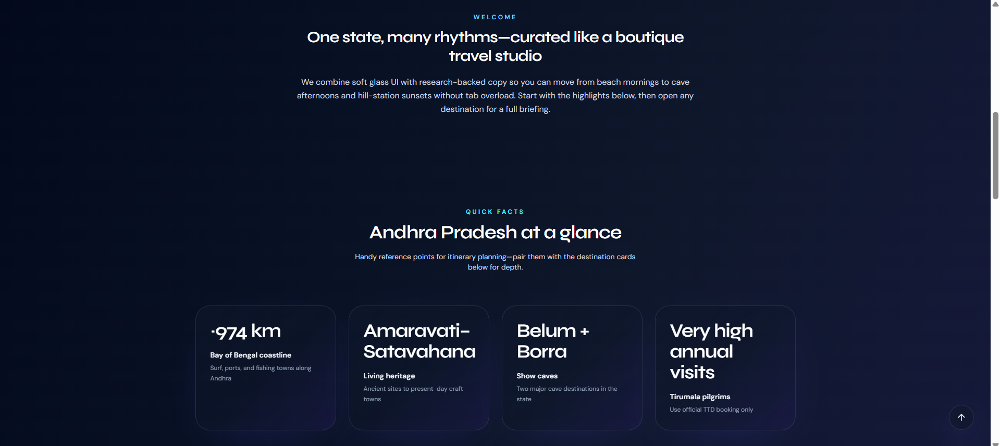

### 3. AndhraVista Popular Destinations Preview Cards
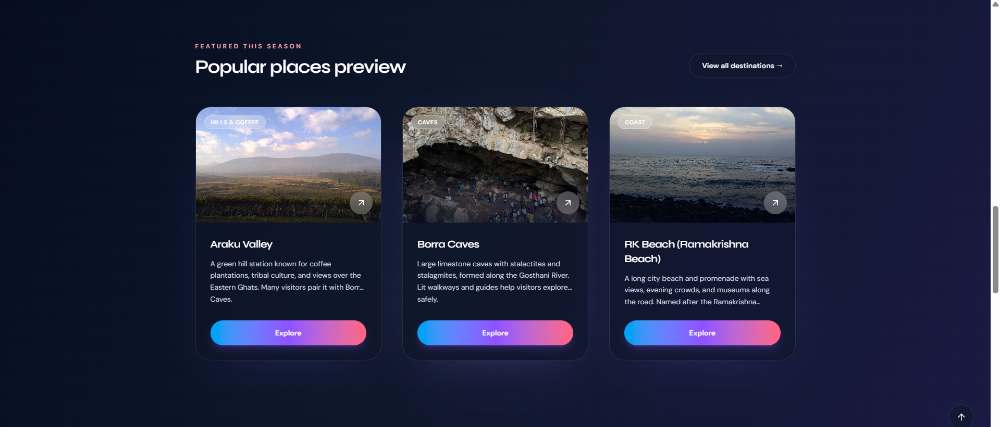

### 4. AndhraVista Visitor Testimonials Section
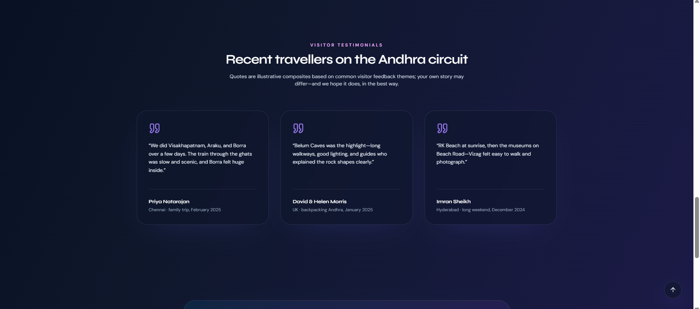

### 5. AndhraVista Footer Call-to-Action
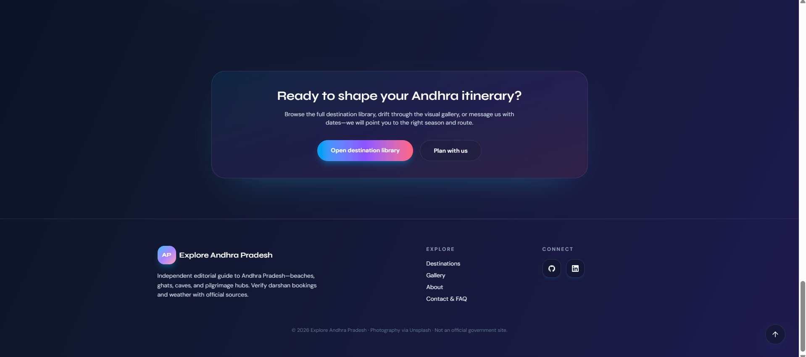

### 6. AndhraVista Destinations Library Listing Page
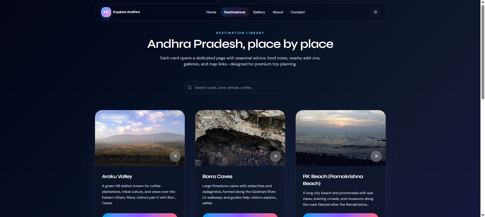

### 7. AndhraVista Destination Cards Grid Continued
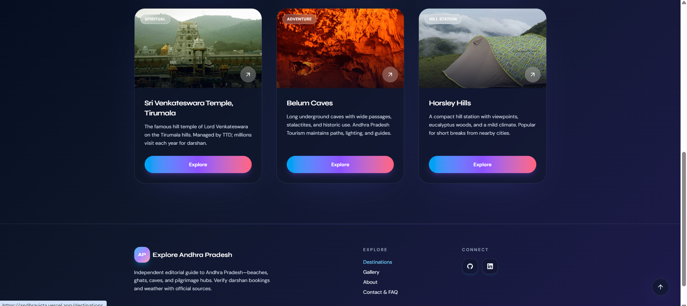

### 8. AndhraVista Sri Venkateswara Temple Detail Page
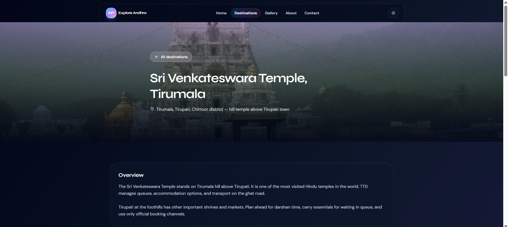

### 9. AndhraVista Destination Practical Info Cards
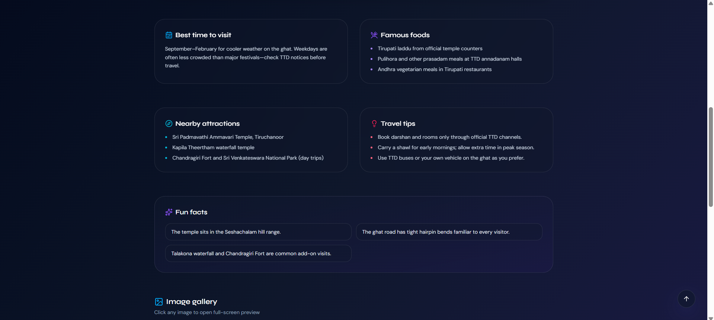

### 10. AndhraVista Destination Gallery and Map Embed
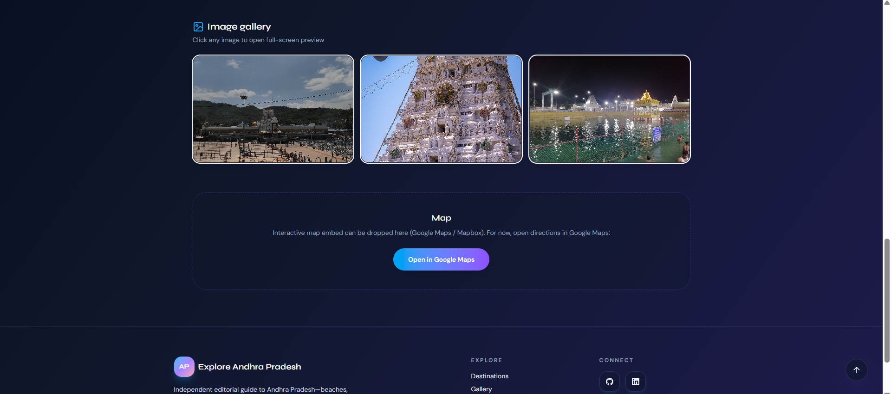

### 11. AndhraVista Masonry Photo Gallery Page
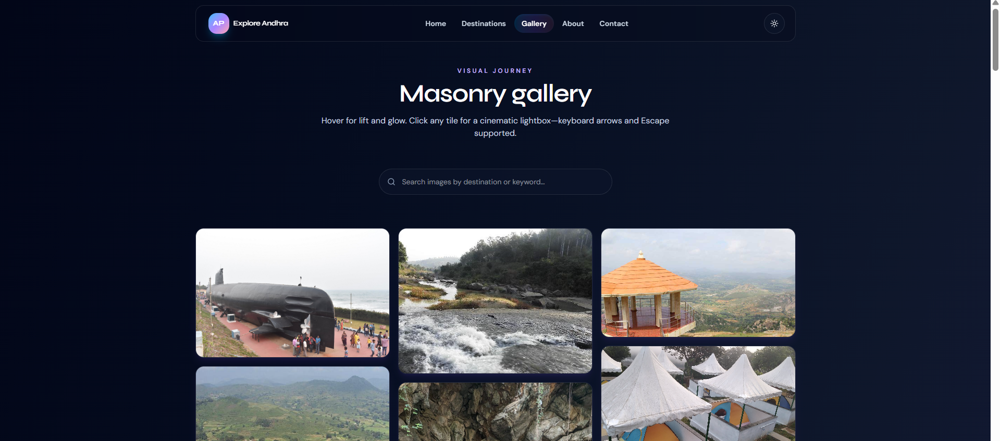

### 12. AndhraVista Photo Gallery Grid with Landscapes
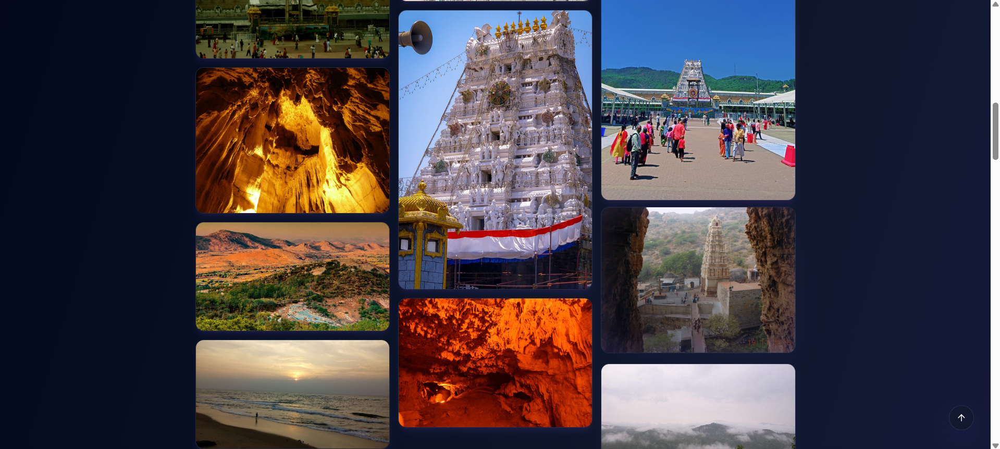

### 13. AndhraVista About Page Tourism Overview
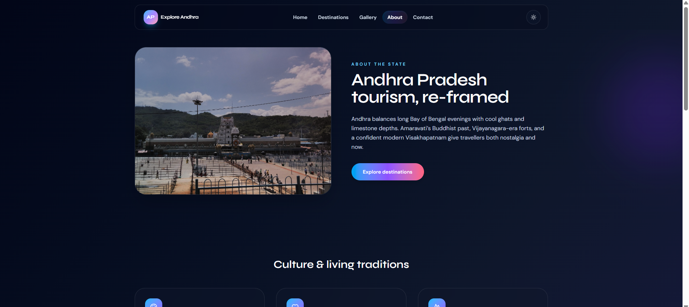

### 14. AndhraVista Why Visit Andhra Pradesh Features
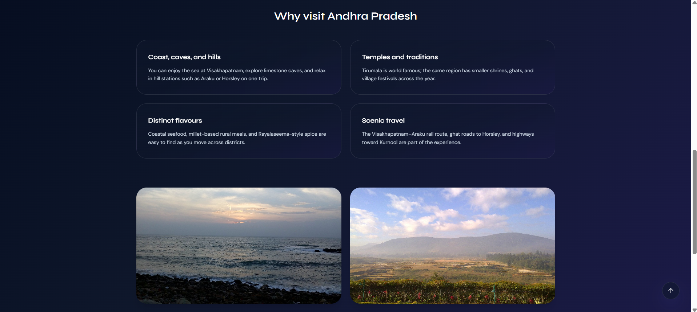

### 15. AndhraVista Contact Form and FAQ Page
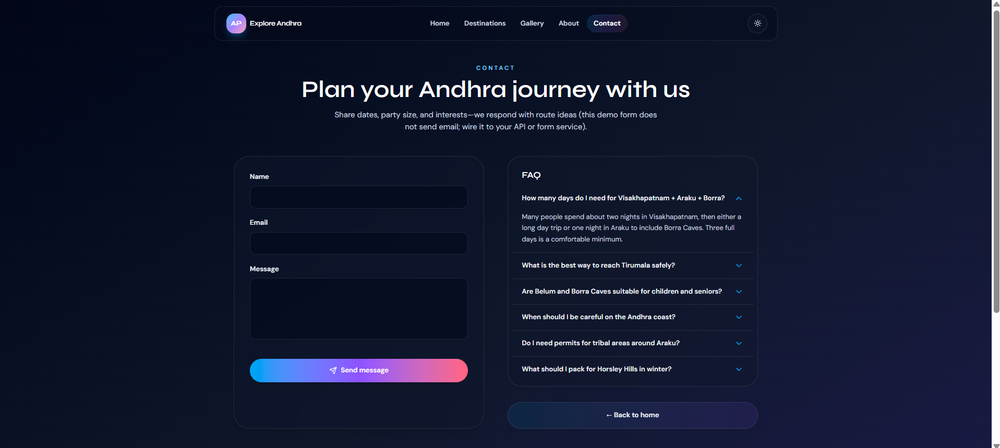

## 🛠️ Technologies Used
This project is built using modern web technologies:

- **React:** Core library for building the user interface.
- **Vite:** Next-generation frontend tooling for fast development.
- **Tailwind CSS:** Utility-first CSS framework for rapid and modern styling.
- **Framer Motion:** For fluid and dynamic animations.
- **Firebase:** Backend database operations and hosting.
- **Lucide React:** Beautiful and consistent icon set.

## 📁 Project Structure
```text
AndhraVista/
│
├── public/            # Static assets
├── src/
│   ├── components/    # Reusable UI components
│   ├── pages/         # Application views and routes
│   ├── data/          # Static data for destinations and gallery
│   ├── App.jsx        # Main application component
│   └── main.jsx       # Entry point
├── images/            # Project screenshots
├── package.json       # Project dependencies and scripts
└── vite.config.js     # Vite configuration
```

## 🚀 How to Run the Project
Follow these simple steps to run AndhraVista on your local machine:

1. **Clone the repository:**
   ```bash
   git clone https://github.com/Akash-Vunnam/AndhraVista.git
   cd AndhraVista
   ```

2. **Install the required dependencies:**
   ```bash
   npm install
   ```

3. **Run the Vite development server:**
   ```bash
   npm run dev
   ```

4. **Access the application:**
   Open your web browser and go to `http://localhost:5173/`.

## 🔮 Future Improvements
- Add interactive 360-degree virtual tours of major destinations.
- Integrate an AI-powered trip planner and itinerary generator.
- Implement user accounts for saving favorite destinations.
- Add multi-language support for international tourists.

## 👨‍💻 Author
**Akash Reddy**

- GitHub: [@Akash-Vunnam](https://github.com/Akash-Vunnam)
- LinkedIn: [Vunnam Akash Reddy](https://www.linkedin.com/in/akash-reddy-vunnam/)

Feel free to reach out for any collaborations or queries!
⭐ If you find this project useful, please give it a star on GitHub!

---

**About**
AndhraVista – A modern, interactive tourism web application showcasing the heritage, culture, and scenic beauty of Andhra Pradesh. Built with React, Tailwind CSS, Framer Motion, and Firebase.
